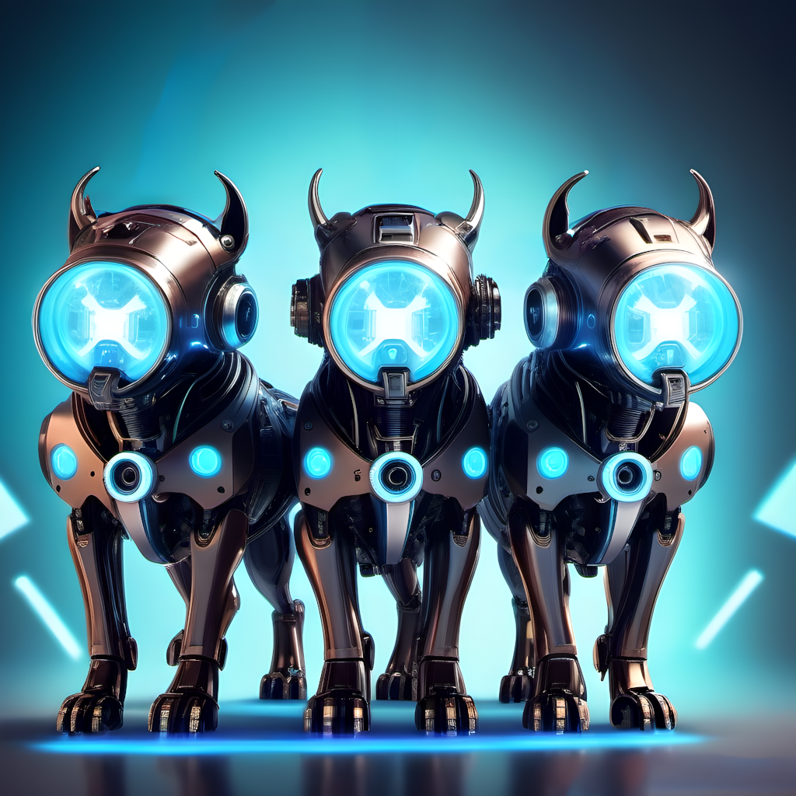

# cerbero-7b Italian LLM 🚀 

> 🚀 **New Release**: **cerbero-7b-openchat** our latest SOTA model based on [**openchat3.5**](https://github.com/imoneoi/openchat), delivering performance **on par with** or **superior** to **ChatGPT 3.5**!

> 🔥 The research paper unveiling the secrets behind **cerbero-7b** is now available on [arXiv](https://arxiv.org/abs/2311.15698)!

> 📢 **cerbero-7b** is the first **100% Free** and Open Source **Italian Large Language Model** (LLM) ready to be used for **research** or **commercial applications**.

**Try an online demo [here](https://cerbero.rocks/)**

<p align="center">
  
</p>

Built on top of [**mistral-7b**](https://mistral.ai/news/announcing-mistral-7b/), which outperforms Llama2 13B across all benchmarks and surpasses Llama1 34B in numerous metrics.

**cerbero-7b** is specifically crafted to fill the void in Italy's AI landscape.

A **cambrian explosion** of **Italian Language Models** is essential for building advanced AI architectures that can cater to the diverse needs of the population.

**cerbero-7b**, alongside companions like [**Camoscio**](https://github.com/teelinsan/camoscio) and [**Fauno**](https://github.com/RSTLess-research/Fauno-Italian-LLM), aims to help **kick-start** this **revolution** in Italy, ushering in an era where sophisticated **AI solutions** can seamlessly interact with and understand the intricacies of the **Italian language**, thereby empowering **innovation** across **industries** and fostering a deeper **connection** between **technology** and the **people** it serves.

**cerbero-7b** is released under the **permissive** Apache 2.0 **license**, allowing **unrestricted usage**, even **for commercial applications**.

## Model Evaluation Results 📈

The `cerbero-7b` model has been rigorously evaluated across several benchmarks to demonstrate its proficiency in understanding and generating Italian text. Below are the summarized results showcasing its performance:

### SQuAD-it Evaluation

The Stanford Question Answering Dataset (SQuAD) in Italian (SQuAD-it) is used to evaluate the model's reading comprehension and question-answering capabilities. The following table presents the F1 score and Exact Match (EM) metrics:

| Model                                        | F1 Score | Exact Match (EM) |
|----------------------------------------------|--------------|----------------------|
| **cerbero-7b-openchat**                      | **74.09%**   | **56.0%**            |
| **cerbero-7b**                               | **72.55%**   | **55.6%**            |
| Fauno                                        | 44.46%       | 0.00%                |
| Camoscio                                     | 37.42%       | 0.00%                |
| mistral-7b                                   | 15.55%       | 8.50%                |

### EVALITA Benchmark Results

EVALITA benchmarks assess the model's performance in tasks like toxicity detection, irony detection, and sentiment analysis. The table below shows the F1 scores for these tasks:

| Model                                        | Toxicity Detection | Irony Detection | Sentiment Analysis |
|----------------------------------------------|--------------------|-----------------|--------------------|
| **cerbero-7b-openchat**                      | **63.33%**         | **69.16%**      | **66.89%**         |
| **cerbero-7b**                               | **63.04%**         | **48.51%**      | **61.80%**         |
| Fauno                                        | 33.84%             | 39.17%          | 12.23%             |
| Camoscio                                     | 38.18%             | 39.65%          | 13.33%             |
| mistral-7b                                   | 34.16%             | 34.16%          | 12.14%             |


## Why Cerbero? 🤔

The name "Cerbero," inspired by the three-headed dog that guards the gates of the Underworld in Greek mythology, encapsulates the essence of our model, drawing strength from three foundational pillars:

- **Base Model: mistral-7b** 🏗️
  cerbero-7b builds upon the formidable **mistral-7b** as its base model. This choice ensures a robust foundation, leveraging the power and capabilities of a cutting-edge language model.

- **Datasets: Cerbero Dataset** 📚
  The Cerbero Dataset is a groundbreaking collection specifically curated to enhance the proficiency of cerbero-7b in understanding and generating Italian text. This dataset is a product of an innovative method combining dynamic self-chat mechanisms with advanced Large Language Model (LLM) technology. Refer to the [paper](https://arxiv.org/abs/2311.15698) for more details.

- **Licensing: Apache 2.0** 🕊️
  Released under the **permissive Apache 2.0 license**, cerbero-7b promotes openness and collaboration. This licensing choice empowers developers with the freedom for unrestricted usage, fostering a community-driven approach to advancing AI in Italy and beyond.

## Models 🧬

**cerbero-7b** is available in various flavors, each tailored for specific applications and use cases. Below is a table listing these versions along with their respective training datasets and base models:

| Model Name              | Training Dataset  | Base Model  | Huggingface Model | Llama.cpp and Quantized Model |
|-------------------------|-------------------|-------------|-------------------|-------------------------------|
| cerbero-7b              | Cerbero Dataset   | mistral-7b  | [link](https://huggingface.co/galatolo/cerbero-7b) | [link](https://huggingface.co/galatolo/cerbero-7b-gguf) |
| cerbero-7b-openchat     | Cerbero Dataset   | openchat3.5 | [link](https://huggingface.co/galatolo/cerbero-7b-openchat) | [link](https://huggingface.co/galatolo/cerbero-7b-openchat-gguf) |


Each of these models brings its unique strengths to the table, making **cerbero-7b** a versatile tool for both research and commercial applications in the Italian language AI domain.

We are committed to continuously enhancing **cerbero-7b**. Our team plans to keep training and releasing new models as advancements in the 7b SOTA occur. This ensures that **cerbero-7b** remains at the forefront of AI technology, offering the most advanced and efficient solutions in the Italian language AI sector.

If you do not have enough RAM to fit the `float32` model (for example when using Colab) we provide for each model a `float16` version using the `revision="float16"` argument 

```python
model = AutoModelForCausalLM.from_pretrained("galatolo/cerbero-7b", revision="float16")
```

## Training Details 🚀

**cerbero-7b** is a **fully fine-tuned** LLM, distinguishing itself from LORA or QLORA fine-tunes. 
The model is trained on an expansive Italian Large Language Model (LLM) using synthetic datasets generated through dynamic self-chat on a large context window of **8192 tokens**

### Dataset Composition 📊

> 📢 Details on the **Cerbero Dataset** will be updated shortly!

### Training Setup ⚙️

**cerbero-7b** is trained on an NVIDIA DGX H100:

- **Hardware:** Utilizing 8xH100 GPUs, each with 80 GB VRAM. 🖥️
- **Parallelism:** DeepSpeed Zero stage 1 parallelism for optimal training efficiency.✨

The model has been trained for **1 epoch**, ensuring a convergence of knowledge and proficiency in handling diverse linguistic tasks.

## Prompt Format

**cerbero-7b** supports 🤗**Chat Templates** using the `tokenizer.apply_chat_template` function.

The model is trained on full conversations using the following prompt format:

```
[|Umano|] First human message
[|Assistente|] First AI reply
[|Umano|] Second human message
[|Assistente|] Second AI reply
```

When crafting prompts, ensure to conclude with the `[|Assistente|]` tag, signaling the AI to generate a response.
Use `[|Umano|]` as stop word. 

For example:

```
[|Umano|] Come posso distinguere un AI da un umano?
[|Assistente|]
```

While it's possible to include a brief system message at the start of your prompt, remember that the training data for **cerbero-7b** **does not** contain such **system messages**. Hence, it's recommended to minimize or avoid including them for optimal model performance.

## Getting Started 🚀

You can load **cerbero-7b** (or **cerbero-7b-openchat**) using [🤗transformers](https://huggingface.co/docs/transformers/index)

```python
import torch
from transformers import pipeline

pipe = pipeline('text-generation', model="galatolo/cerbero-7b")

messages=[
    {
        "role": "system",
        "content": "Conversazione tra un umano ed un assistente AI."
    },
    {
        "role": "user",
        "content": "Come posso distinguere un AI da un umano?"
    },
]


prompt = pipe.tokenizer.apply_chat_template(messages, tokenize=False, add_generation_prompt=True)
generated_text = pipe(prompt, max_new_tokens=128)[0]['generated_text']

print(generated_text)
```

### GGUF and llama.cpp

**cerbero-7b** is fully **compatibile** with [llama.cpp](https://github.com/ggerganov/llama.cpp)

You can find the **original** and **quantized** versions of **cerbero-7b** in the `gguf` format [here](https://huggingface.co/galatolo/cerbero-7b-gguf/tree/main)

```python
from llama_cpp import Llama
from huggingface_hub import hf_hub_download  

llm = Llama(
    model_path=hf_hub_download(
        repo_id="galatolo/cerbero-7b-gguf",
        filename="ggml-model-f16.gguf",
    ),
    n_ctx=4086,
) 

llm.generate("""Questa è una conversazione tra un umano ed un assistente AI.
[|Umano|] Come posso distinguere un AI da un umano?
[|Assistente|]""")
```

## Differences from the paper

> 📢 Attention: The released versions of `cerbero-7b` slightly differ from those used in the paper. The training dataset for the released models was generated using `llama-65b` instead of `llama-2-70b-chat`, due to the more permissive license of the `llama-65b` model (CC-BY-NC 4.0). Our tests indicate that both models produce datasets of comparable quality, and the resulting fine-tuned models demonstrate nearly indistinguishable performance

## Citation 📖

If you use **cerbero-7b** in your research, please cite our paper:

```bibtex
@article{galatolo2023cerbero,
  title={Cerbero-7B: A Leap Forward in Language-Specific LLMs Through Enhanced Chat Corpus Generation and Evaluation},
  author={Galatolo, Federico A and Cimino, Mario GCA},
  journal={arXiv preprint arXiv:2311.15698},
  year={2023}
}
```